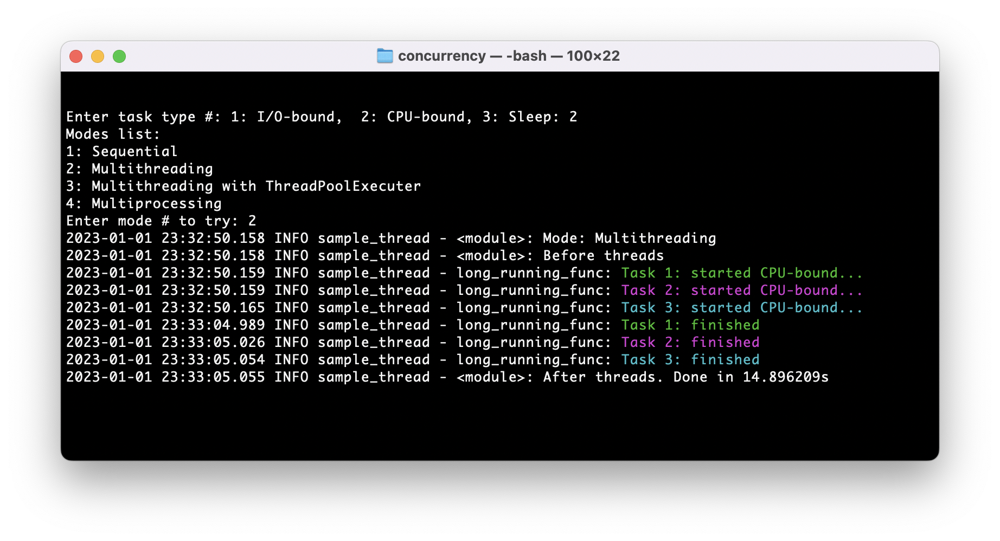
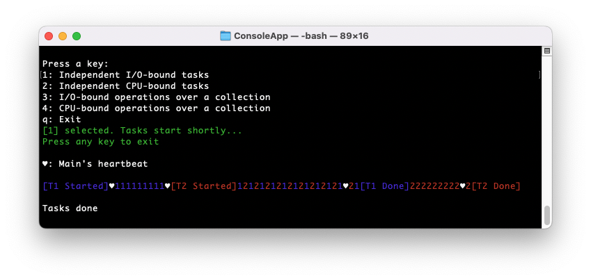
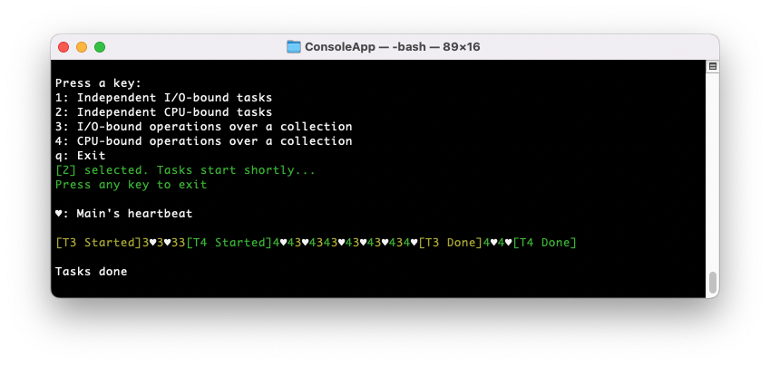
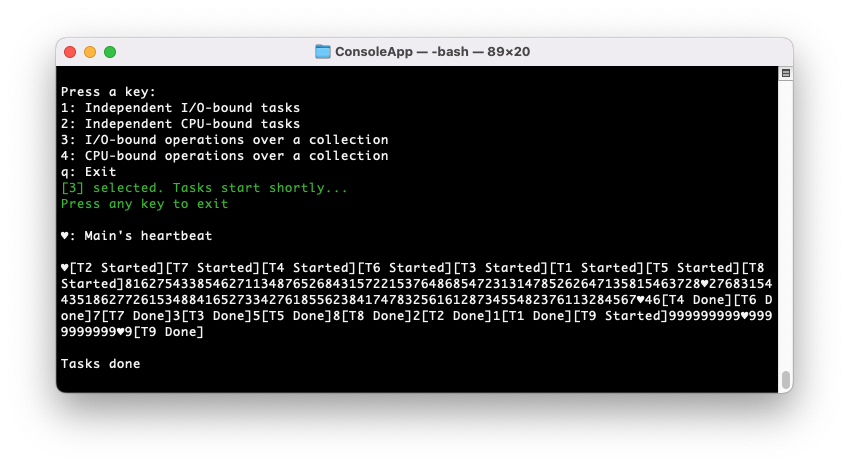
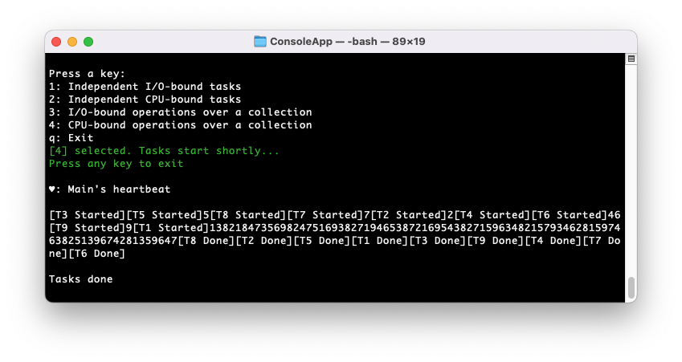

# concurrency
Exploring concurrent programming.

Sample codes demo concurrency via async, multithreading and multiprocessing methods in:

* `py`: Python
* `cs`: C# / .NET

## Concurrency in Python

### I. Multithreading and Multiprocessing

`py/sample_thread.py` allows testing _multithreading_ and _multiprocessing_ for different tasks, including I/O-bound and CPU-bound. 

#### Example: CPU-Bound Tasks

The following tests demonstrates that for CPU-bound tasks in Python, _multithreading_ doesn't help, while  _multiprocessing_ helps. 

1. CPU-Bound, Sequential: ~15s (benchmark)

2. CPU-Bound, Multithreading: ~15s (no gain) 

3. CPU-Bound, Multiprocessing: ~5s (huge gain) 

### II. Asynchronous I/O

`py/sample_async.py` leverages Python's [asyncio](https://docs.python.org/3/library/asyncio.html).

 

## Concurrency in C# / .NET

`/cs/ConsoleApp` provides a menu of different concurrency methods. Tasks print their unique IDs (0 - 9), also color coded for two concurrent tasks. The main method prints a heartbeat character (♥), allowing to recocognize the methods that don't block the main thread:

1. Independent I/O-bound tasks

2. Independent CPU-bound tasks

3. I/O-bound operations over a collection

4. CPU-bound operations over a collection

