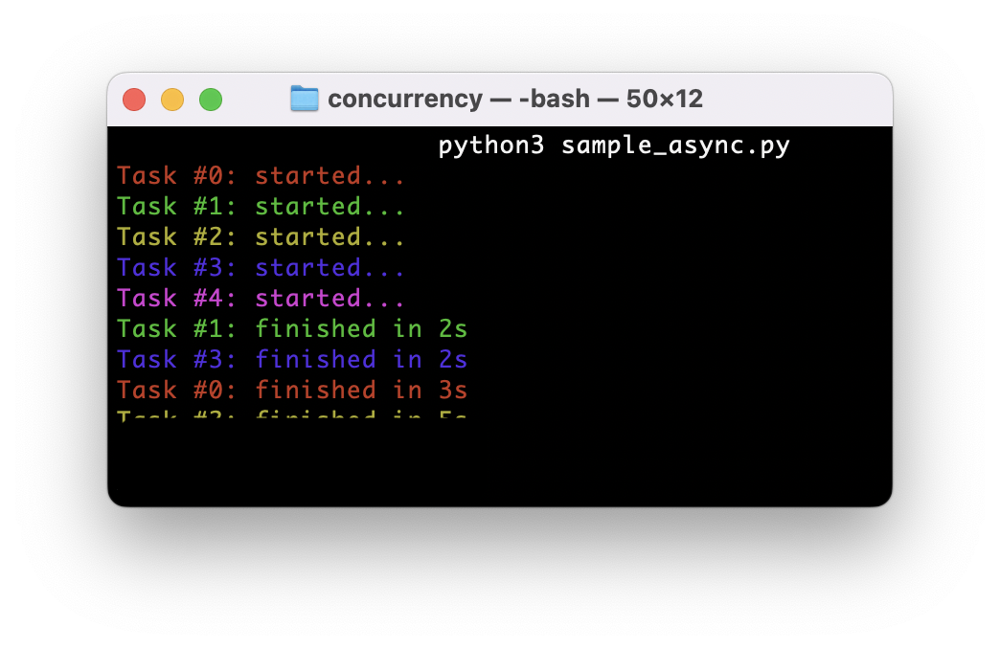

# concurrency
Exploring concurrent programming.

## Concurrency in Python

### I. Multithreading and Multiprocessing

`sample_thread.py` allows testing _multithreading_ and _multiprocessing_ for different tasks, including I/O-bound and CPU-bound. 

#### Example: CPU-Bound Tasks

The following tests demonstrates that for CPU-bound tasks in Python, _multithreading_ doesn't help, while  _multiprocessing_ helps. 

1. CPU-Bound, Sequential: ~15s (benchmark)

2. CPU-Bound, Multithreading: ~15s (no gain) 

3. CPU-Bound, Multiprocessing: ~5s (huge gain) 

### II. Asynchronous I/O

`sample_async.py` leverages Python's [asyncio](https://docs.python.org/3/library/asyncio.html).

